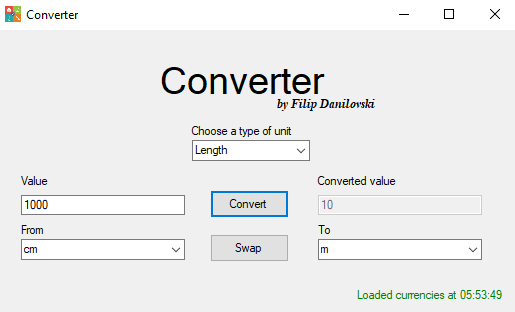
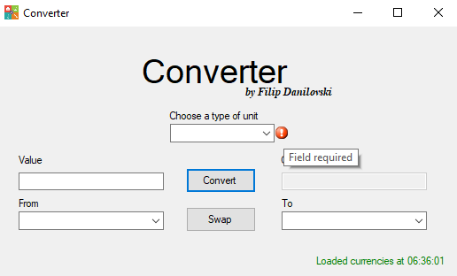
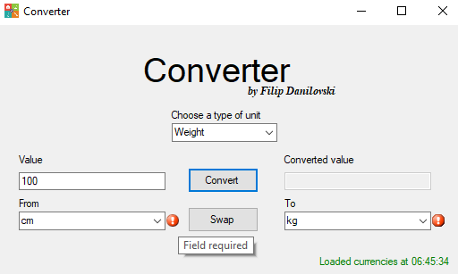
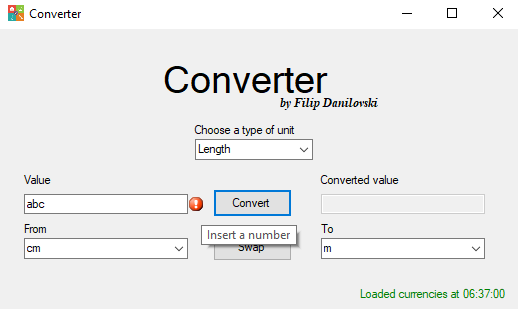

# Converter
Windows Forms project by: Filip Danilovski
## 1. Опис на апликација
Апликацијата што ја развивав е конверзија на валути и мерни единици. Преку неа може да се претвараат вредности на една мерна единица во друга од типови како должина, маса, време, пренос на податоци (Data Transfer Rate), како и валути чии вредности се вадат од интернет преку API (Application Programming Interface) на секоја минута.
## 2. Упатство за користење
Апликацијата има еден прозорец на кој се понудени три dropdown листи со кои се бираат посакуваните мерни единици за конверзија. Дадено е текст поле во кое се внесува посакуваната вредност и се стиснува на копчето Convert, со што доколку е успешна конверзијата ќе се прикаже резултатот од неговата десна страна.

Во случај на корисничка грешка, воведени се валидациски провајдери за грешки кои ќе го известат корисникот каде се наоѓа грешката, како на пример:
* Корисникот нема да може да ја искористи функцијата на копчето Convert доколку сите полиња не се пополнети.
 
* Корисникот нема да може да направи манипулација на селектираните вредности од листа со цел да прави конверзија на мерни единици кои не се од ист тип.
 
* Корисникот нема да може да внесе вредност во даденото текст поле која не претставува цел или децимален број.
 
Постои и копче Swap со кое корисникот може лесно да ги замени избраните мерни единици и да врши конверзија во обратна насока. Во долно-десниот агол е поставена лабела која му го кажува на корисникот статусот на вадените податоци за валути од интернет.
## 3. Решение на проблемот
